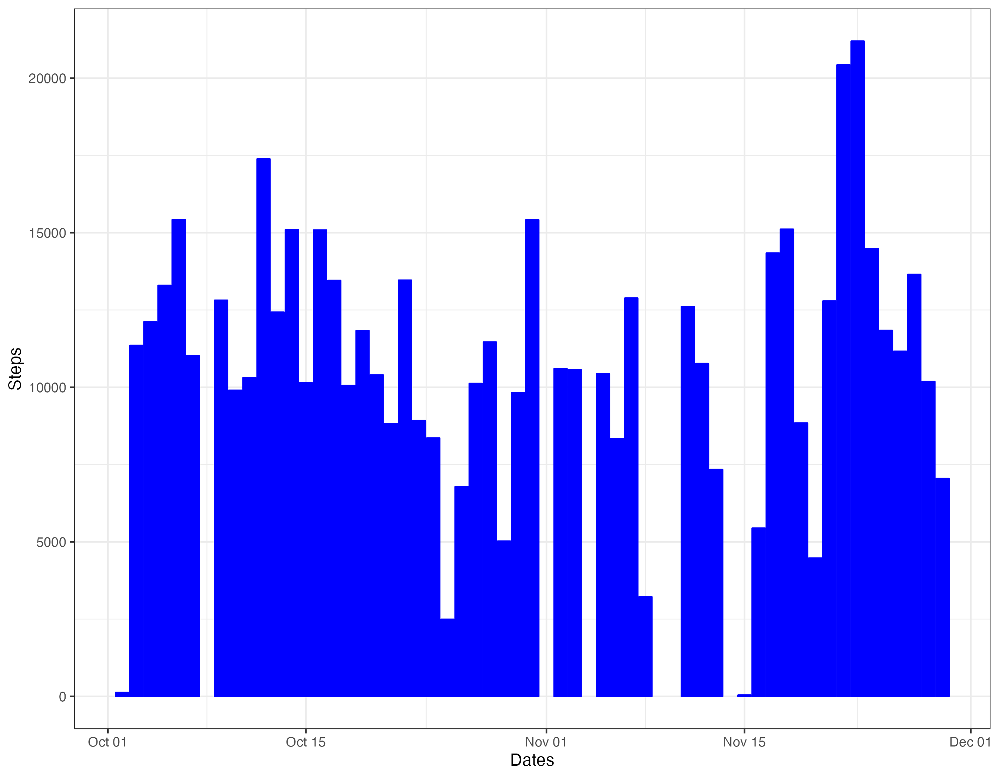
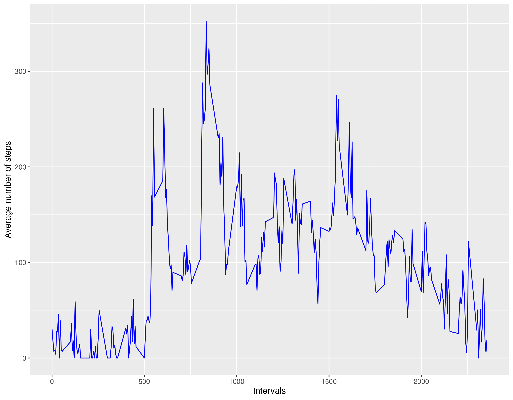
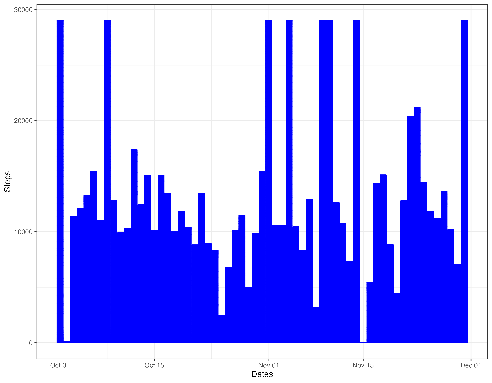
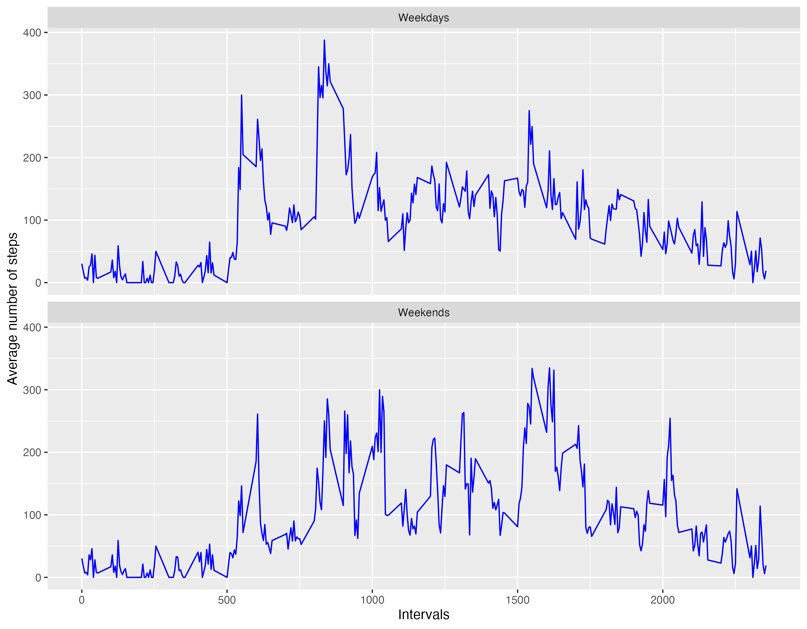

## Loading and preprocessing data
This assignment demonstrate how to prepare the environment with all the R libraries required to perform the data analysis as well as the locations of the source file. Then the data is read into a dataframe.
## Uploading R libraries needed
  These are the packages and libraries required
  
"dplyr"

"ggplot2"

"plotly"

"lemon"

## Reading the data
Here is the location of the data source needed (previously provided by the assignment instruction page)

setwd <<Path to location>>

The comma separated file is extracted for the provided "zip" file

unzip("repdata_data_activity.zip")

Then all the data content is uploaded into the dataframe named "act_df" and ready to be processed

act_df\<\-read.csv("activity.csv")

and Transform the date character into an r date variable

act_df\$date\<-as.Date(act_df\$date)

Here are the questions posed by the assignment and my analysis

## What is mean total number of steps taken per day?
The total number of steps taken each day of the experiment is shown on the following table

Table: Total number of steps by dates

|date       | Total_steps|
|:----------|-----------:|
|2012-10-02 |         126|
|2012-10-03 |       11352|
|2012-10-04 |       12116|
|2012-10-05 |       13294|
|2012-10-06 |       15420|
|2012-10-07 |       11015|
|2012-10-09 |       12811|
|2012-10-10 |        9900|
|2012-10-11 |       10304|
|2012-10-12 |       17382|
|2012-10-13 |       12426|
|2012-10-14 |       15098|
|2012-10-15 |       10139|
|2012-10-16 |       15084|
|2012-10-17 |       13452|
|2012-10-18 |       10056|
|2012-10-19 |       11829|
|2012-10-20 |       10395|
|2012-10-21 |        8821|
|2012-10-22 |       13460|
|2012-10-23 |        8918|
|2012-10-24 |        8355|
|2012-10-25 |        2492|
|2012-10-26 |        6778|
|2012-10-27 |       10119|
|2012-10-28 |       11458|
|2012-10-29 |        5018|
|2012-10-30 |        9819|
|2012-10-31 |       15414|
|2012-11-02 |       10600|
|2012-11-03 |       10571|
|2012-11-05 |       10439|
|2012-11-06 |        8334|
|2012-11-07 |       12883|
|2012-11-08 |        3219|
|2012-11-11 |       12608|
|2012-11-12 |       10765|
|2012-11-13 |        7336|
|2012-11-15 |          41|
|2012-11-16 |        5441|
|2012-11-17 |       14339|
|2012-11-18 |       15110|
|2012-11-19 |        8841|
|2012-11-20 |        4472|
|2012-11-21 |       12787|
|2012-11-22 |       20427|
|2012-11-23 |       21194|
|2012-11-24 |       14478|
|2012-11-25 |       11834|
|2012-11-26 |       11162|
|2012-11-27 |       13646|
|2012-11-28 |       10183|
|2012-11-29 |        7047|
Here is the histogram plot for the total number of steps taken each day

The assignment asked to calculate the mean number of steps and here is the table with the data

Table: Mean number steps by dates

|date       | average_steps|
|:----------|-------------:|
|2012-10-02 |     0.4375000|
|2012-10-03 |    39.4166667|
|2012-10-04 |    42.0694444|
|2012-10-05 |    46.1597222|
|2012-10-06 |    53.5416667|
|2012-10-07 |    38.2465278|
|2012-10-09 |    44.4826389|
|2012-10-10 |    34.3750000|
|2012-10-11 |    35.7777778|
|2012-10-12 |    60.3541667|
|2012-10-13 |    43.1458333|
|2012-10-14 |    52.4236111|
|2012-10-15 |    35.2048611|
|2012-10-16 |    52.3750000|
|2012-10-17 |    46.7083333|
|2012-10-18 |    34.9166667|
|2012-10-19 |    41.0729167|
|2012-10-20 |    36.0937500|
|2012-10-21 |    30.6284722|
|2012-10-22 |    46.7361111|
|2012-10-23 |    30.9652778|
|2012-10-24 |    29.0104167|
|2012-10-25 |     8.6527778|
|2012-10-26 |    23.5347222|
|2012-10-27 |    35.1354167|
|2012-10-28 |    39.7847222|
|2012-10-29 |    17.4236111|
|2012-10-30 |    34.0937500|
|2012-10-31 |    53.5208333|
|2012-11-02 |    36.8055556|
|2012-11-03 |    36.7048611|
|2012-11-05 |    36.2465278|
|2012-11-06 |    28.9375000|
|2012-11-07 |    44.7326389|
|2012-11-08 |    11.1770833|
|2012-11-11 |    43.7777778|
|2012-11-12 |    37.3784722|
|2012-11-13 |    25.4722222|
|2012-11-15 |     0.1423611|
|2012-11-16 |    18.8923611|
|2012-11-17 |    49.7881944|
|2012-11-18 |    52.4652778|
|2012-11-19 |    30.6979167|
|2012-11-20 |    15.5277778|
|2012-11-21 |    44.3993056|
|2012-11-22 |    70.9270833|
|2012-11-23 |    73.5902778|
|2012-11-24 |    50.2708333|
|2012-11-25 |    41.0902778|
|2012-11-26 |    38.7569444|
|2012-11-27 |    47.3819444|
|2012-11-28 |    35.3576389|
|2012-11-29 |    24.4687500|
Total number of observations 53

As well as the median steps by date

Table: Median number steps by dates

|date       | median_steps|
|:----------|------------:|
|2012-10-02 |         63.0|
|2012-10-03 |         61.0|
|2012-10-04 |         56.5|
|2012-10-05 |         66.0|
|2012-10-06 |         67.0|
|2012-10-07 |         52.5|
|2012-10-09 |         48.0|
|2012-10-10 |         56.5|
|2012-10-11 |         35.0|
|2012-10-12 |         46.0|
|2012-10-13 |         45.5|
|2012-10-14 |         60.5|
|2012-10-15 |         54.0|
|2012-10-16 |         64.0|
|2012-10-17 |         61.5|
|2012-10-18 |         52.5|
|2012-10-19 |         74.0|
|2012-10-20 |         49.0|
|2012-10-21 |         48.0|
|2012-10-22 |         52.0|
|2012-10-23 |         56.0|
|2012-10-24 |         51.5|
|2012-10-25 |         35.0|
|2012-10-26 |         36.5|
|2012-10-27 |         72.0|
|2012-10-28 |         61.0|
|2012-10-29 |         54.5|
|2012-10-30 |         40.0|
|2012-10-31 |         83.5|
|2012-11-02 |         55.5|
|2012-11-03 |         59.0|
|2012-11-05 |         66.0|
|2012-11-06 |         52.0|
|2012-11-07 |         58.0|
|2012-11-08 |         42.5|
|2012-11-11 |         55.0|
|2012-11-12 |         42.0|
|2012-11-13 |         57.0|
|2012-11-15 |         20.5|
|2012-11-16 |         43.0|
|2012-11-17 |         65.5|
|2012-11-18 |         80.0|
|2012-11-19 |         34.0|
|2012-11-20 |         58.0|
|2012-11-21 |         55.0|
|2012-11-22 |         65.0|
|2012-11-23 |        113.0|
|2012-11-24 |         65.5|
|2012-11-25 |         84.0|
|2012-11-26 |         53.0|
|2012-11-27 |         57.0|
|2012-11-28 |         70.0|
|2012-11-29 |         44.5|
Total number of observations 53

_All this data was calculated by ignoring the NA values from the source data_

## What is the average daily activity pattern?

___The plot shows that interval "835" contains the maximum number of average steps with a value of 352.___

### Imputing missing values
I used the average step calculation per interval to replace the NA values in the original source data.
I added a new dataframe to hold the updated data

Here is the histogram plot for the updated data

The assignment asked to recalculate the mean number of steps and here is the table with the data

Table: Mean number steps by dates (with imputted data)

|date       | average_steps|
|:----------|-------------:|
|2012-10-01 |   100.8297664|
|2012-10-02 |     0.4375000|
|2012-10-03 |    39.4166667|
|2012-10-04 |    42.0694444|
|2012-10-05 |    46.1597222|
|2012-10-06 |    53.5416667|
|2012-10-07 |    38.2465278|
|2012-10-08 |   100.8297664|
|2012-10-09 |    44.4826389|
|2012-10-10 |    34.3750000|
|2012-10-11 |    35.7777778|
|2012-10-12 |    60.3541667|
|2012-10-13 |    43.1458333|
|2012-10-14 |    52.4236111|
|2012-10-15 |    35.2048611|
|2012-10-16 |    52.3750000|
|2012-10-17 |    46.7083333|
|2012-10-18 |    34.9166667|
|2012-10-19 |    41.0729167|
|2012-10-20 |    36.0937500|
|2012-10-21 |    30.6284722|
|2012-10-22 |    46.7361111|
|2012-10-23 |    30.9652778|
|2012-10-24 |    29.0104167|
|2012-10-25 |     8.6527778|
|2012-10-26 |    23.5347222|
|2012-10-27 |    35.1354167|
|2012-10-28 |    39.7847222|
|2012-10-29 |    17.4236111|
|2012-10-30 |    34.0937500|
|2012-10-31 |    53.5208333|
|2012-11-01 |   100.8297664|
|2012-11-02 |    36.8055556|
|2012-11-03 |    36.7048611|
|2012-11-04 |   100.8297664|
|2012-11-05 |    36.2465278|
|2012-11-06 |    28.9375000|
|2012-11-07 |    44.7326389|
|2012-11-08 |    11.1770833|
|2012-11-09 |   100.8297664|
|2012-11-10 |   100.8297664|
|2012-11-11 |    43.7777778|
|2012-11-12 |    37.3784722|
|2012-11-13 |    25.4722222|
|2012-11-14 |   100.8297664|
|2012-11-15 |     0.1423611|
|2012-11-16 |    18.8923611|
|2012-11-17 |    49.7881944|
|2012-11-18 |    52.4652778|
|2012-11-19 |    30.6979167|
|2012-11-20 |    15.5277778|
|2012-11-21 |    44.3993056|
|2012-11-22 |    70.9270833|
|2012-11-23 |    73.5902778|
|2012-11-24 |    50.2708333|
|2012-11-25 |    41.0902778|
|2012-11-26 |    38.7569444|
|2012-11-27 |    47.3819444|
|2012-11-28 |    35.3576389|
|2012-11-29 |    24.4687500|
|2012-11-30 |   100.8297664|
As well as to recalculate median steps by date

Table: Median number steps by dates (with imputted data)

|date       | median_steps|
|:----------|------------:|
|2012-10-01 |     103.9412|
|2012-10-02 |      63.0000|
|2012-10-03 |      61.0000|
|2012-10-04 |      56.5000|
|2012-10-05 |      66.0000|
|2012-10-06 |      67.0000|
|2012-10-07 |      52.5000|
|2012-10-08 |     103.9412|
|2012-10-09 |      48.0000|
|2012-10-10 |      56.5000|
|2012-10-11 |      35.0000|
|2012-10-12 |      46.0000|
|2012-10-13 |      45.5000|
|2012-10-14 |      60.5000|
|2012-10-15 |      54.0000|
|2012-10-16 |      64.0000|
|2012-10-17 |      61.5000|
|2012-10-18 |      52.5000|
|2012-10-19 |      74.0000|
|2012-10-20 |      49.0000|
|2012-10-21 |      48.0000|
|2012-10-22 |      52.0000|
|2012-10-23 |      56.0000|
|2012-10-24 |      51.5000|
|2012-10-25 |      35.0000|
|2012-10-26 |      36.5000|
|2012-10-27 |      72.0000|
|2012-10-28 |      61.0000|
|2012-10-29 |      54.5000|
|2012-10-30 |      40.0000|
|2012-10-31 |      83.5000|
|2012-11-01 |     103.9412|
|2012-11-02 |      55.5000|
|2012-11-03 |      59.0000|
|2012-11-04 |     103.9412|
|2012-11-05 |      66.0000|
|2012-11-06 |      52.0000|
|2012-11-07 |      58.0000|
|2012-11-08 |      42.5000|
|2012-11-09 |     103.9412|
|2012-11-10 |     103.9412|
|2012-11-11 |      55.0000|
|2012-11-12 |      42.0000|
|2012-11-13 |      57.0000|
|2012-11-14 |     103.9412|
|2012-11-15 |      20.5000|
|2012-11-16 |      43.0000|
|2012-11-17 |      65.5000|
|2012-11-18 |      80.0000|
|2012-11-19 |      34.0000|
|2012-11-20 |      58.0000|
|2012-11-21 |      55.0000|
|2012-11-22 |      65.0000|
|2012-11-23 |     113.0000|
|2012-11-24 |      65.5000|
|2012-11-25 |      84.0000|
|2012-11-26 |      53.0000|
|2012-11-27 |      57.0000|
|2012-11-28 |      70.0000|
|2012-11-29 |      44.5000|
|2012-11-30 |     103.9412|
___These updated calculations differ from the earlier ones since we have replaced all NA values with average steps and that also increased the number of observations from 53 to 61___

## Are there differences in activity patterns between weekdays and weekends?
Here are the time series plots that show the total number of steps on weekdays and weekends

___This data shows that the maximum number steps taken is higher during weekdays 387 than the weekends maximum of 334___
___Also, the peak intervals for weekdays runs in the range of 535:905 in comparison to the weekends range of 1530:1700___
